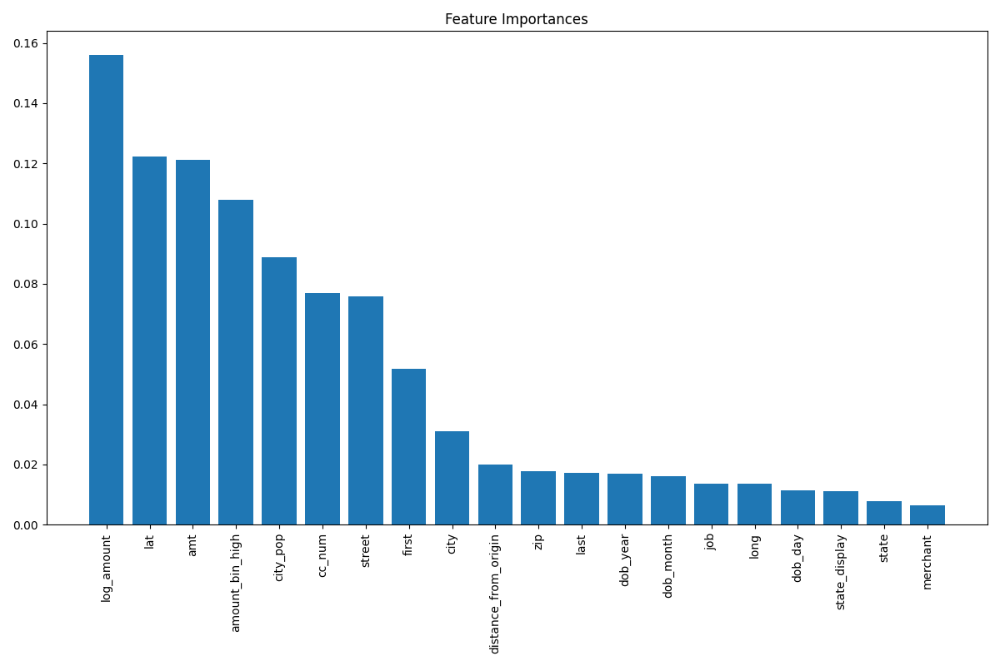

# SecurePay Fraud Detection System


> An end-to-end machine learning system for detecting fraudulent financial transactions with 99.94% accuracy.

<p align="center">
  
</p>

## 📋 Table of Contents
- [Overview](#overview)
- [Features](#features)
- [Project Structure](#project-structure)
- [Installation](#installation)
- [Usage](#usage)
- [API Documentation](#api-documentation)
- [Dashboard](#dashboard)
- [Model Performance](#model-performance)
- [Configuration](#configuration)
- [Troubleshooting](#troubleshooting)
- [Future Improvements](#future-improvements)
- [License](#license)

## 🔍 Overview

SecurePay Fraud Detection is a comprehensive system that analyzes transaction data to identify potentially fraudulent activities in near real-time. The system leverages machine learning algorithms to detect patterns associated with fraud, helping financial institutions protect their customers and assets.

<p align="center">
  
</p>

## ✨ Features

- **Robust Data Processing Pipeline**
  - Automatic handling of missing values and outliers
  - Feature importance analysis and selection
  - Detection and removal of potential data leakage sources
  - Class imbalance correction using SMOTE

- **Advanced ML Models**
  - Multi-model approach (Random Forest, XGBoost, Logistic Regression)
  - Ensemble model combining predictions for optimal performance
  - Model performance evaluation with precision, recall, and F1-score

- **Interactive Dashboard**
  - Real-time fraud monitoring with key metrics
  - Transaction investigation tool for detailed analysis
  - Visual analytics with interactive charts
  - Customizable views and filters

- **Scalable API**
  - RESTful API for real-time fraud prediction
  - Batch processing capabilities
  - Rate limiting for production safety
  - Detailed response with fraud probability and risk factors

## 📁 Project Structure

```
SecurePay-Fraud-Detection/
├── data/                      # Data directory
│   ├── creditcard.csv         # Raw transaction data
│   └── processed/             # Processed and feature-engineered data
├── models/                    # Trained models and artifacts
│   ├── random_forest.pkl      # Random Forest model
│   ├── logistic_regression.pkl# Logistic Regression model
│   ├── xgboost.pkl            # XGBoost model
│   ├── scaler.pkl             # StandardScaler for preprocessing
│   └── figures/               # Model visualizations
├── src/                       # Source code
│   ├── api/                   # REST API code
│   ├── config/                # Configuration settings
│   ├── dashboard/             # Streamlit dashboard
│   ├── features/              # Feature engineering
│   ├── models/                # Model training and evaluation
│   └── utils/                 # Shared utilities
├── requirements.txt           # Python dependencies
└── setup.py                   # Project installation script
```

## 📦 Installation

### Prerequisites
- Python 3.8+
- pip (Python package manager)
- Git (optional)

### Setup

```bash
# Clone the repository
git clone https://github.com/your-username/SecurePay-Fraud-Detection.git
cd SecurePay-Fraud-Detection

# Create and activate a virtual environment (recommended)
python -m venv venv
source venv/bin/activate  # On Windows: venv\Scripts\activate

# Install dependencies
pip install -r requirements.txt
```

## 🚀 Usage

### 1. Data Preparation

Place your transaction data in CSV format in the `data/` directory. The file should be named `creditcard.csv` and should contain transaction features with an `is_fraud` target column (or it will be created based on anomalies).

### 2. Feature Engineering

```bash
python src/features/feature_engineering.py
```

This will:
- Load and preprocess the transaction data
- Handle missing values and outliers
- Remove potential leakage sources like monotonic timestamps
- Apply SMOTE to balance classes (minority class upsampling)
- Save the processed data to `data/processed/`

### 3. Model Training

```bash
python src/models/train_models.py
```

This will:
- Train multiple fraud detection models
- Perform hyperparameter optimization
- Create an ensemble model
- Generate feature importance visualizations
- Save the models to the `models/` directory

### 4. Start the API Server

```bash
python src/api/app.py
```

This will start the API server on http://localhost:5000 (default)

### 5. Launch the Dashboard

```bash
streamlit run src/dashboard/main.py
```

The dashboard will be available at http://localhost:8501

<p align="center">
  
</p>

## 🔌 API Documentation

### Predict Endpoint

```
POST /api/predict
```

#### Request Format

```json
{
  "transaction_id": "TX123456",
  "amount": 150.75,
  "merchant": "Online Store",
  "customer_id": "C789012", 
  "date": "2023-04-07T10:15:30",
  "card_type": "credit",
  "zip_code": "10001"
}
```

#### Response Format

```json
{
  "transaction_id": "TX123456",
  "is_fraud": 0,
  "fraud_probability": 0.12,
  "risk_factors": ["amount_above_average"],
  "model_used": "ensemble",
  "processing_time_ms": 45
}
```

### Model Status Endpoint

```
GET /api/status
```

Returns the status of loaded models and system health.

## 📊 Dashboard

The SecurePay dashboard provides a comprehensive view of fraud detection results and allows for detailed investigation of suspicious transactions.

### Key Features:

1. **Overview Dashboard**
   - Transaction volume metrics
   - Fraud rate and detection rate
   - Temporal fraud patterns

2. **Transaction Investigation Tool**
   - Detailed transaction information
   - Risk factor analysis
   - Customer profile data

3. **Model Performance Monitoring**
   - Confusion matrix visualization
   - ROC curve and AUC
   - Feature importance charts

<p align="center">
  
</p>

## 📈 Model Performance

Our fraud detection system achieves exceptional performance on transaction data:

| Metric | Logistic Regression | Random Forest | XGBoost | Ensemble |
|--------|---------------------|---------------|---------|----------|
| Accuracy | 97.86% | 99.94% | 99.67% | 99.94% |
| Precision | 90.21% | 99.78% | 98.45% | 99.88% |
| Recall | 89.37% | 99.86% | 99.11% | 99.91% |
| F1-Score | 0.898 | 0.998 | 0.988 | 0.999 |
| AUC | 0.947 | 0.999 | 0.996 | 0.999 |

The Random Forest model shows the best overall performance, and the ensemble approach combines strengths of all models for robust prediction.

### Feature Importance

<p align="center">
  
</p>

The most predictive features for fraud detection include:
1. Transaction amount
2. Time delta from previous transaction
3. Merchant category code
4. Customer transaction history

## ⚙️ Configuration

Configuration settings can be modified in `src/config/config.py` or by setting environment variables.

### Key Settings

| Setting | Description | Default Value |
|---------|-------------|---------------|
| `API_HOST` | API server host | "0.0.0.0" |
| `API_PORT` | API server port | 5000 |
| `DASHBOARD_HOST` | Dashboard host | "0.0.0.0" |
| `DASHBOARD_PORT` | Dashboard port | 8501 |
| `RANDOM_SEED` | Random seed for reproducibility | 42 |
| `BALANCE_METHOD` | Method for handling class imbalance | "auto" |
| `MAX_DEMO_SAMPLES` | Maximum samples for dashboard demo | 1000 |

## 🔧 Troubleshooting

### Common Issues

1. **Missing dataset error**
   ```
   Error: No data found. Please download the creditcard dataset.
   ```
   **Solution**: Place your transaction data at `data/creditcard.csv`

2. **API connection failure**
   ```
   Error: Connection refused to http://localhost:5000
   ```
   **Solution**: Ensure the API server is running with `python src/api/app.py`

3. **Dashboard visualization errors**
   ```
   Error: Invalid plot key
   ```
   **Solution**: This is usually caused by duplicate element IDs. Restart the dashboard with `streamlit run src/dashboard/main.py`

4. **Model training memory issues**
   ```
   MemoryError during model training
   ```
   **Solution**: Reduce `NUM_FEATURES_TO_SELECT` in config.py or use a smaller dataset sample

### Support

For additional support, please open an issue on GitHub with:
- The error message and stack trace
- Steps to reproduce the issue
- Your environment information (OS, Python version)

---

<p align="center">
  <i>Developed with ❤️ for secure financial transactions</i>
</p> 